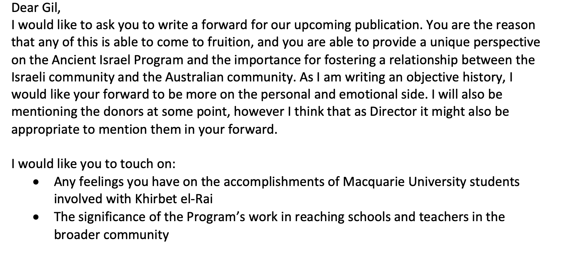
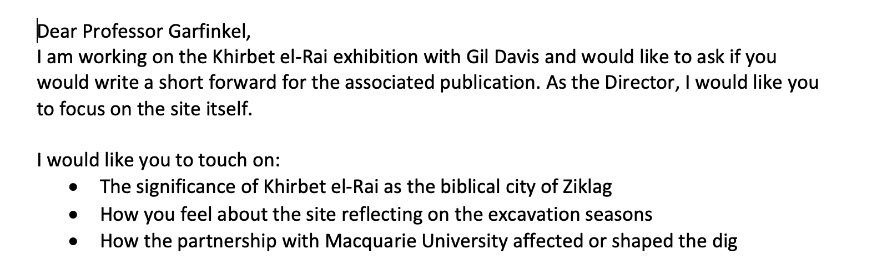
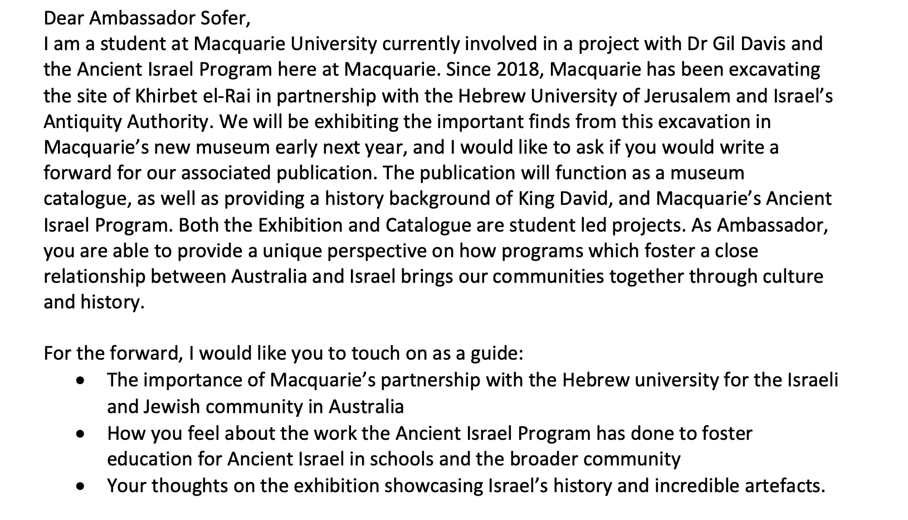
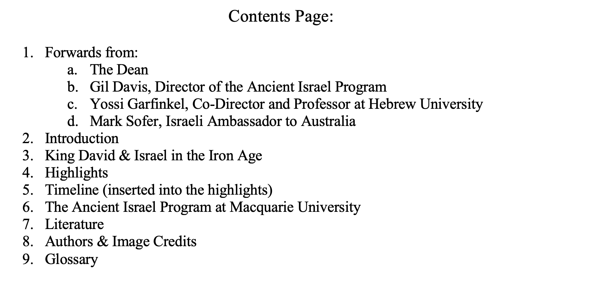

# The Creation of a Catalogue

 My primary task in this project is the creation of the accompanying catalogue. This semester I focused on researching and articulating the physical and technical qualities in preparation for approaching publishers, as well as planning and creating 'contextualising' content. 

 Planning and researching the technical aspects of the catalogue was a two-step process. 

 **First,** I retrieved as many physical copies of museum publications as possible. These catalogues encompassed a variety of topics, and each conveyed their collections and information in different and creative ways. While surveying these catalogues I focused on:
   * Fonts, page textures, physical size and weight of the publication
   * Page layout
   * The inclusion of additional content
   * Creativity and aesthetics
   * The factors which contributed or reduced viewer fatigue

**Second,** I began to research publishing terminologies like GSM, standard sizing, text specifications, and coating and binding. From my initial catalogue research, I already had in mind what I did and did not like in a publication, and this stage allowed me to rephrase these ideas with the appropriate publishing jargon. I then created an ‘info-pack’ based on feedback and discussion from my catalogue research in order to convey this information to my team.  

## Forwards, Contents, and Context
Now that we had an idea of what we wanted our catalogue to look like, it was time to focus on the content. In my opinion, the best catalogues conveyed not only material culture, but also history and human accomplishments. We also needed to consider our audience, and that some may be highly esteemed biblical academics who are interested in the archaeological developments, and some may be generally interested people who have no idea who King David is (like me, before this project).
I decided that we would include:

   * **A history of the Ancient Israel Program:** This program has created enormous opportunities for Macquarie Students and the wider community, and I felt it was important that readers were aware of the program and its accomplishments. A preview of this piece is included [here](AHistory.md) and will also be published on Macquarie's Ancient History Blog. 
   * **A History of King David:** The significance of Khirbet el-Ra'i lies in its connection to King David in the biblical tradition. The story of King David is grand and exciting, and I think it's important to include a short history for those not already familiar. This piece must remain accessible and enjoyable to read but secular and academic in its sources and content. This piece was requested by Gil in the planning stages of this project and is still in the research stage. 
   * **A timeline visual:** Every discipline uses different terminology to express blocks of historical dates, so providing a visual timeline to understand the difference between 'Early Iron Age IA' and 'Byzantium' will increase the catalogues accessibility and readability.

Forwards appear to be standard practice for this type of publication, and we all felt it would be important to include different perspectives to express the significance of the project. I decided that our forwards should come from:

   * Dr Gil Davis
   * Dean Möllering
   * Professor Yosef Garfinkel
   * Israeli Ambassador to Australia Mark Sofer

I have drafted these forward requests, which express the reason these four people were selected. These forwards also provide an opportunity to create an emotive and personal element in our publication. It is important to note that these drafts are very much 'rough' drafts and will undergo more revision and polishing before being sent to Gil for editing and a final send-off later in the year. 

With the content of the catalogue established, it was time to draft a contents page. Knowing the number of components establishes a checklist going forward and helps us manage page count for publication. An initial contents page was drafted based on discussion in our bimonthly zoom meetings. As the catalogue is still in its early stages, the contents page is still preliminary and available for revision.

