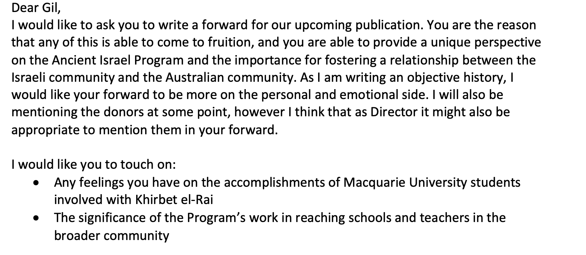

From 2018 until 2020, Macquarie University has partnered with the Hebrew University of Jerusalem to excavate the ancient site of Khirbet el-Ra'i. These excavations led to exciting discoveries of Canaanite material culture, as well as receiving significant press coverage over its identification as [Ziklag](https://www.heritagedaily.com/2020/04/rare-figurines-uncovered-at-lost-biblical-city/127574). During the final season in 2020, Dr Gil Davis began discussions with Professor Yosef Garfinkel (Co-director of the dig, and Professor at the Hebrew University) and Saar Ganor (Israel Antiquity Authority) for Macquarie University to host an exhibition of the important finds in the newly built museum. And thus, the Khirbet el-Ra'i Exhibition Project was born. 



The Khirbet el-Ra'i Exhibition Project is a student-led project with two primary goals:

1. Launch an exhibition in early 2021 
2. Create and publish an accompanying catalogue 

This is a 12-18-month project. The following blog posts will detail my role in this project, the work which will be published, and the work yet to be done.



## Contents
 
1. [The Creation of a Catalogue](TheCreationofaCatalogue.md)
2. [Writing Blog Posts](WritingBlogPosts.md)
3. [A History of the Ancient Israel Program](AHistory.md)
4. [Curators Pick: The Lamp-and-Bowl Deposit](Curatorspick.md)
5. [Planning an Exhibition: Where to from here](PlanninganExhibition.md)

*Header Image: Khirbet el-Ra'i at sunrise. Photography © Sophie Gidley on behalf of Macquarie University*

# The Creation of a Catalogue

 My primary task in this project is the creation of the accompanying catalogue. This semester I focused on researching and articulating the physical and technical qualities in preparation for approaching publishers, as well as planning and creating 'contextualising' content. 

 Planning and researching the technical aspects of the catalogue was a two-step process. 

 **First,** I retrieved as many physical copies of museum publications as possible. These catalogues encompassed a variety of topics, and each conveyed their collections and information in different and creative ways. While surveying these catalogues I focused on:
   * Fonts, page textures, physical size and weight of the publication
   * Page layout
   * The inclusion of additional content
   * Creativity and aesthetics
   * The factors which contributed or reduced viewer fatigue

**Second,** I began to research publishing terminologies like GSM, standard sizing, text specifications, and coating and binding. From my initial catalogue research, I already had in mind what I did and did not like in a publication, and this stage allowed me to rephrase these ideas with the appropriate publishing jargon. I then created an ‘info-pack’ based on feedback and discussion from my catalogue research in order to convey this information to my team.  

## Forwards, Contents, and Context
Now that we had an idea of what we wanted our catalogue to look like, it was time to focus on the content. In my opinion, the best catalogues conveyed not only material culture, but also history and human accomplishments. We also needed to consider our audience, and that some may be highly esteemed biblical academics who are interested in the archaeological developments, and some may be generally interested people who have no idea who King David is (like me, before this project).
I decided that we would include:

   * **A history of the Ancient Israel Program:** This program has created enormous opportunities for Macquarie Students and the wider community, and I felt it was important that readers were aware of the program and its accomplishments. A preview of this piece is included [here](AHistory.md) and will also be published on Macquarie's Ancient History Blog. 
   * **A History of King David:** The significance of Khirbet el-Ra'i lies in its connection to King David in the biblical tradition. The story of King David is grand and exciting, and I think it's important to include a short history for those not already familiar. This piece must remain accessible and enjoyable to read but secular and academic in its sources and content. This piece was requested by Gil in the planning stages of this project and is still in the research stage. 
   * **A timeline visual:** Every discipline uses different terminology to express blocks of historical dates, so providing a visual timeline to understand the difference between 'Early Iron Age IA' and 'Byzantium' will increase the catalogues accessibility and readability.

Forwards appear to be standard practice for this type of publication, and we all felt it would be important to include different perspectives to express the significance of the project. I decided that our forwards should come from:

   * Dr Gil Davis
   * Dean Möllering
   * Professor Yosef Garfinkel
   * Israeli Ambassador to Australia Mark Sofer

I have drafted these forward requests, which express the reason these four people were selected. These forwards also provide an opportunity to create an emotive and personal element in our publication. It is important to note that these drafts are very much 'rough' drafts and will undergo more revision and polishing before being sent to Gil for editing and a final send-off later in the year. 

With the content of the catalogue established, it was time to draft a contents page. Knowing the number of components establishes a checklist going forward and helps us manage page count for publication. An initial contents page was drafted based on discussion in our bimonthly zoom meetings. As the catalogue is still in its early stages, the contents page is still preliminary and available for revision.

# Blog Posts

As the Khirbet el-Ra'i Exhibition Project is a longer-term project, we needed to produce 'submission' content for PACE. We decided to create blog posts for the MQ Ancient History Blog. At least one blog based on the project, and one blog as a 'curators pick' to showcase some of the exciting items in our exhibition. The 'Curators Pick' enabled us to further engage unit themes of significance and communicating history. Creating blog posts also enabled us to practice writing academic topics for a non-academic audience, which is a skill I must hone for the catalogue essays. 

Creating these blog posts required several hours of meetings with Dr Brian Ballsun-Stanton, the faculty of Arts' Solutions Architect. To publish our blog posts, we needed to learn to write Markdown, how to use and work collaboratively in Atom, and how to push our work onto the Ancient History Git repository for publication. These blog posts will serve as marketing for our exhibition in the lead up to the launch in 2021. Our posts will have a staggered publishing schedule from July through to December.

The two blog posts I have created for the MQ Ancient History Blog are:

   * [A History of the Ancient Israel Program](AHistory.md)
   * [Curators Pick: The 'Lamp-and-Bowl' Foundation Deposit](Curatorspick.md)

## Researching the Blog Posts

### A History of the Ancient Israel Program

Collating the information for this blog post required different research techniques traditionally employed by the ancient historian. I began with my own and my cohort's shared experiences with the program through the 2020 Khirbet el-Ra'i dig. Then, Gil provided me with reports and executive summaries he had produced for the Program's donors from 2015 - 2018. These reports were produced sporadically, so I searched out Macquarie blog posts which mentioned any of the achievements the Program has accomplished. At this point there were still large gaps in my research, so I collated a series of questions for Gil Davis, the program director (and as I discovered, Founder) to answer. 

### Curators Pick: The 'Lamp-and-Bowl' Deposit

The research of this blog post employed traditional research techniques - searching through primary sources and accompanying research. 

# A History of Macquarie's Ancient Israel Program

In the glory of the sunrise on the 27th of January 2020, 32 students from Macquarie University began their hike up the sloping hill of Khirbet el-Ra'i to start their second full day of excavation. With sore limbs and a sense of excitement permeating through the group, they began to wonder - *what would we find today?* By the end of three weeks of excavation, that question could be answered with an array of incredible treasures. An intact foundation deposit, a bronze bracelet, a bronze smiting god figurine, and a small animal figure were amongst the ancient trove of this season’s uncovered finds. The opportunity for Macquarie students to learn excavation methods on a historically vibrant biblical site is just one of the opportunities provided by the Ancient Israel Program, which is founded and directed by Macquarie’s own Dr Gil Davis.



The Ancient Israel Program was founded in 2012, with goals to:

   * Broaden the ancient Israel offering in Macquarie’s already diverse department of Ancient history

   * Advocate for the inclusion of ancient Israel in the school curriculum and;

   * Create awareness and promote the education of ancient Israel to the general public.

Through the Ancient Israel Program, the Ancient Israel Outreach Fellowship was established. The Outreach Fellowship succeeded in reintroducing ancient Israel back into the Ancient History School Curriculum. The teaching of ancient Israel in schools was further supported by the Outreach program with online resources for classrooms. Teachers were also able to enhance their own historical knowledge and passion with first-hand experience in Israel, sponsored by the Ancient Israel Program.  

In 2013, The Ancient Israel Program partnered with the Tel Aviv University in Israel. This collaboration created the opportunity for Macquarie Students to excavate at the site of Tel Azekah. By 2017, over 150 Macquarie students and HSC teachers had travelled to Israel to experience the archaeology ‘in-situ’. In 2016 the Program strengthened its Israeli ties by establishing an annual Biblical Archaeology and Summer Ulpan course with the Hebrew University of Jerusalem. These courses afforded Macquarie University students the extraordinary opportunity to experience Ancient Israel from the pinnacle of Masada and the City of David rather than just through books and lecture theatres.



In 2018, the burgeoning relationship between Macquarie University and the Hebrew University of Jerusalem fostered by the Ancient Israel Program bloomed with the establishment of a jointly coordinated excavation at the site of Khirbet el-Ra'i. Co-directed by Dr Kyle Keimer (Macquarie University), Professor Yosef Garfinkel (The Hebrew University of Jerusalem) and Mr Saar Ganor (Israel Antiquities Authority), Khirbet el-Ra'i promised to be an exciting site with its known 12th, 11th and 10th c. CE settlements. After four seasons of joint excavation, Khirbet el-Ra'i was identified as the biblical town Ziklag. Ziklag is a town closely associated with King David in the biblical tradition, with the town being given to David by the Philistine King in 1 Samuel 30 before his enthronement.

> So on that day Achish gave him Ziklag, and it has belonged to the kings of Judah ever since. 
1 Samuel 26:6

During the 2019 winter season, an on-site chemistry lab was introduced led by Macquarie’s Dr Sophia Aharonovich. The chemistry lab not only allowed for real-time sample testing, but it also provided an innovative and unparalleled opportunity for Macquarie students to expand their archaeological skills. All Macquarie students who participated in the 2019 and 2020 excavations undertook sampling and analysis training in the field, meaning all students contributed to our understanding of human activity at Khirbet el-Ra'i and future research.



The opportunities afforded to both students and teachers through the Ancient Israel Program would not be possible without the generosity of donors.

# Curators Pick: The Lamp-and-Bowl foundation deposit

## The foundation deposits of Khirbet el-Rai

Foundation deposits are an archaeological phenomenon found throughout the ancient world, including ancient Egypt, Nubia, the Levant, and ancient Mesopotamia. During the 2018-2020 excavations at Khirbet el-Ra'i in Israel, four foundation deposits were discovered underneath Canaanite houses. These foundation deposits represent an ancient and well-attested ritual, which was practiced prior to the construction of both domestic and public buildings. These four deposits from Khirbet el-Ra'i, called ‘lamp-and-bowl’ deposits, will feature in the upcoming Khirbet el-Ra'i exhibition. 



## What are Foundation Deposits?

Foundation deposits are usually a collection of items placed underneath buildings as part of a rite, ritual or blessing. This was a particularly common practice in Ancient Egypt and considered to be an essential component of temple construction from the Old Kingdom onwards. The nature and contents of these deposits changed throughout pharaonic history, but deposits were typically placed at corners and beneath the walls of temples and tombs prior to their construction. 

The practice of foundation deposits did not solely belong to the ancient Egyptians, these deposits have also been found further east and in broader contexts. In fact, clay tablets from Nineveh describe the use of foundation deposits in a domestic context. These Akkadian tablets describe the entire foundation ritual: 

   1. Sacrifice a ram.
   2. Libate the foundations of the house with ‘fine quality’ liquids such as honey, beer, wine and oil.  
   3. Place a deposit of important items such as grain, gold, fabric, and even semi-precious stones under the house’s foundations. 

The placing of a foundation deposit served to protect and sanctify the building, and to protect both the structure and its inhabitants in perpetuity. 

It is then unsurprising that foundation deposits have been discovered under dwellings and buildings in Israel, especially since the Levant and ancient Canaan served as both a trade, military and cultural highway between Egypt and the ‘Near East’ in the Bronze and Iron Ages. 

## The Lamp-and-Bowl Deposit

Although the contents of a foundation deposits varied greatly in neighbouring cultures, specific ‘lamp-and-bowl’ deposits have been discovered in building foundations all across Israel. Dating to the Late Bronze Age and the Early Iron Age, these deposits consisted of a lamp placed within a bowl, and either one or two inverted bowls placed on top. This ‘lamp-and-bowl’ combination would then be placed beneath domestic dwellings, public buildings, Governor residencies and also Egyptian fortresses (in Canaan). The lamps and bowls appear to be unused, and thus specifically made for the purpose of depositing. Despite foundation deposits being a widespread ancient practice, these ‘lamp-and-bowl’ deposits are completely unique to ancient Israel. The significance of the lamp and bowl is yet to be determined.

### Bibliography

Ambos, C. (2010), "Building Rituals from the First Millennium BC: The Evidence from the Ritual Texts", in M.J, Boda & J. Novotny (eds.), *From the Foundations to the Crenellations: Essays on Temple Building in the Ancient Near East and Hebrew Bible*, pp. 221-237.

Bunimovitz, S. & Zimhoni, O. (1993), "'Lamp-and-Bowl' Foundation Deposits in Canaan", *Israel Exploration Journal*, pp. 99-125.

Keimer, K.H., Garfinkel, Y., Ganor, S., Rollston, C. & Ben-Schlomo, D. (2019) "Khirbet al-Ra'i in the Judean Shephelah: the 2015-2019 Excavation Seasons", *Strata: The Bulletin of the Anglo-Israel Archaeological Society*, pp. 11-44.

Müller, M. (2018) "Foundation Deposits and Strategies of Place-Making at Tell el-Dab'a/Avaris", *Near Eastern Archaeology, 81(3)*, pp. 182-190.

Weinstein, J.M. (2005), "Foundation Deposits", in D.B Redford (ed.), *Oxford Encyclopedia of Ancient Egypt*.

# Planning an Exhibition: Where to from here

The Khirbet el-Ra'i Exhibition Project is still in its infancy, and unfortunately, we experienced some minor setbacks due to CoVid-19. At the beginning of Semester One, we had planned to begin work on launching the exhibition. To do this, we needed to gain access to the new museum space - which has not been possible. Hopefully as restrictions ease over the coming months, we will be able to access to the new space and make progress in this area. The following is an outline of project goals over the second half of the year.

## The Exhibition

   * Establish the exhibition's 'story' and the perspective from which it will be told
   * Work with a designer to curate the space
   * Begin creating textual and visual content for the digital screens
   * Create item labels 
   * Begin work on a 3D model of the Khirbet el-Rai photogrammetry, which will create interactivity in our exhibition space.

## The Catalogue

   * Continue to research and produce content for the catalogue
   * Once we receive the professional item photography, begin curating the design and aesthetic of the catalogue
   * Organise the forwards, relative biblical quotes, and snippets of past student experiences to frame the archaeology from a student perspective
   * Publication! 

## ~~The Inscription~~ *Embargoed Information*
One of the most exciting and significant finds of the Khirbet el-Ra'i excavation was the discovery of an undeciphered ~~proto-canaanite inscription~~ which for academic purposes is currently under **embargo**. This ~~inscription~~ **embargoed item** provides fascinating insight into our understanding of language development, as well as ancient writing and literacy habits. As someone with some experience with ancient languages and a strong interest in semitic language development, I am hoping to produce a display chronicling the development and interactivity of languages in this corner of the ancient world - for the exhibition. By deconstructing the mystery around language, I hope to foster excitement and understanding around what will surely be a focal point in our exhibition. 

## A Digital Space

We floated the idea of creating a digital space to accompany our exhibition to promote engagement and interactivity with a broader audience. A digital space may also allow our exhibition to be more accessible for visitors with disabilities. I approached an experienced software developer, and we should be able to create an online space for our exhibition later in the year. 
